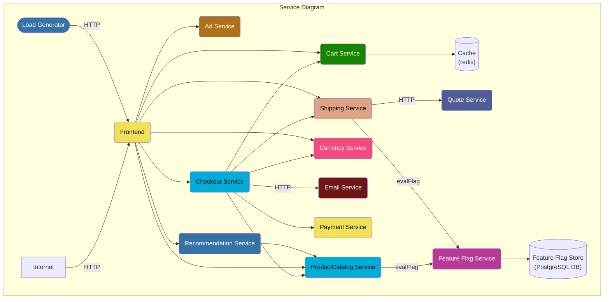
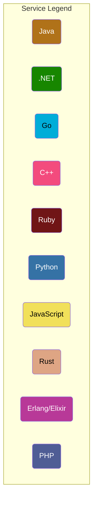

# OpenObservability Workshop
Repository containing the files for the Workshop on OpenObservability


This repository explain the usage of OpenObservability using: 
- the OpenTelemtry Demo application
- the OpenTelemtry collector
- KubeCost
- OpenTelemetry Operator
- The FluentOperator

## Prerequisite
The following tools need to be install on your machine :
- jq
- kubectl
- git
- gcloud ( if you are using GKE)
- Helm


If you don't have any dynatrace tenant , then let's [start a trial on Dynatrace](https://bit.ly/3KxWDvY)

## Deployment Steps in GCP

You will first need a Kubernetes cluster with 4 Nodes.
You can either deploy on Minikube or K3s or follow the instructions to create GKE cluster:

### 1.Create a Google Cloud Platform Project
```
PROJECT_ID="<your-project-id>"
gcloud services enable container.googleapis.com --project ${PROJECT_ID}
gcloud services enable monitoring.googleapis.com \
    cloudtrace.googleapis.com \
    clouddebugger.googleapis.com \
    cloudprofiler.googleapis.com \
    --project ${PROJECT_ID}
```
### 2.Create a GKE cluster
```
NAME=openobservability
ZONE=europe-west3-a
gcloud container clusters create ${NAME} \
--project=${PROJECT_ID} --zone=${ZONE} \
--machine-type=e2-standard-4 --num-nodes=4
```

## Architecture

**Online Boutique** is composed of microservices written in different programming
languages that talk to each other over gRPC and HTTP; and a load generator which
uses [Locust](https://locust.io/) to fake user traffic.





## Getting started 
### Dynatrace Tenant
#### 1. Dynatrace Tenant - start a trial
If you don't have any Dyntrace tenant , then i suggest to create a trial using the following link : [Dynatrace Trial](https://bit.ly/3KxWDvY)
Once you have your Tenant save the Dynatrace (including https) tenant URL in the variable `DT_TENANT_URL` (for example : https://dedededfrf.live.dynatrace.com)
```
DT_TENANT_URL=<YOUR TENANT URL>
```


#### 2. Create the Dynatrace API Tokens
The dynatrace operator will require to have one token:
* Token to ingest metrics and Traces


##### Token to ingest data
Create a Dynatrace token with the following scope:
* ingest metrics
* ingest events  
* ingest OpenTelemetry traces
* ingest Logs
* Data ingest, e.g.: metrics and events
<p align="center"></p>
Save the value of the token . We will use it later to store in a k8S secret

```
DATA_INGEST_TOKEN=<YOUR TOKEN VALUE>
```

### Clone The github Repo
```
git clone https://github.com/henrikrexed/OpenObservability-Workshop
cd OpenObservability-Workshop
```


## Deploy 
The application will deploy the otel demo v1.0.0
```
chmod 777 deployment.sh
./deployment.sh  --dttoken $DATA_INGEST_TOKEN --dturl $DT_TENANT_URL --clustername ${NAME}
```
if you want to deploy a newer version of the otel-demo you will need to add the --oteldemo_version parameter:
for example: 
```
./deployment.sh  --dttoken $DATA_INGEST_TOKEN --dturl $DT_TENANT_URL --clustername ${NAME} --oteldemo_version v0.4.0-alpha
```

## Configure KubeCost

### Add the additional scraping config
We need to edit the Prometheus settings by adding the additional scrape configuration, edit Prometheus with the following command :
```
kubectl get Prometheus
```

here is the expected output:
```
NAME                                    VERSION   REPLICAS   AGE
prometheus-kube-prometheus-prometheus   v2.32.1   1          22h
```

We will need to add an extra property in the configuration object :
```
additionalScrapeConfigs:
  name: addtional-scrape-configs
  key: additionnalscrapeconfig.yaml
```

so to update the object :
```
kubectl edit Prometheus prometheus-kube-prometheus-prometheus
```
### Connect kubecost to prometheus
```
kubectl edit cm kubecost-cost-analyzer  -n kubecost
```
make sure all the configuration are correct :
```
apiVersion: v1
data:
kubecost-token: aGVucmlrLnJleGVkQGR5bmF0cmFjZS5jb20=xm343yadf98
prometheus-alertmanager-endpoint: http://prometheus-kube-prometheus-alertmanager.default.svc:9093
prometheus-server-endpoint: http://prometheus-kube-prometheus-prometheus.default.svc:9090
kind: ConfigMap
metadata:
annotations:
meta.helm.sh/release-name: kubecost
meta.helm.sh/release-namespace: kubecost
labels:
app: cost-analyzer
app.kubernetes.io/instance: kubecost
app.kubernetes.io/managed-by: Helm
app.kubernetes.io/name: cost-analyzer
helm.sh/chart: cost-analyzer-1.92.0
name: kubecost-cost-analyzer
namespace: kubecost
```
### Connect kubecost to Grafana
```
kubectl edit cm nginx-conf -n kubecost
```
update the grafana upstream url :
```
upstream grafana {
server prometheus-grafana.default.svc;
}
```
### Edit the Kubecost ingress rule
```
kubectl edit ingress kubecost-cost-analyzer  -n kubecost
```
make sure to add the following annotation : kubernetes.io/ingress.class: nginx
```
apiVersion: networking.k8s.io/v1
kind: Ingress
metadata:
annotations:
ingress.kubernetes.io/backends: '{"k8s-be-30348--560d80e95126adbd":"UNHEALTHY","k8s-be-31223--560d80e95126adbd":"HEALTHY"}'
ingress.kubernetes.io/forwarding-rule: k8s2-fr-xw9dp7bo-kubecost-kubecost-cost-analyzer-5laj3bq5
ingress.kubernetes.io/target-proxy: k8s2-tp-xw9dp7bo-kubecost-kubecost-cost-analyzer-5laj3bq5
ingress.kubernetes.io/url-map: k8s2-um-xw9dp7bo-kubecost-kubecost-cost-analyzer-5laj3bq5
kubernetes.io/ingress.class: nginx
meta.helm.sh/release-name: kubecost
meta.helm.sh/release-namespace: kubecost
```

## Tutorial

### 1. OpenTelemetry

#### a. OpenTelemetry Demo

##### Look at the current collector pipeline
The sidecar collector : 
```
cat kubernetes-manifests/openTelemetry-sidecar.yaml
```

The collector pipeline :
```
cat kubernetes-manifests/openTelemetry-manifest.yaml
```

##### Modify the current collector pipeline to send the data to dynatrace
look at the modifed version of the pipeline :
```
cat kubernetes-manifests/openTelemetry-manifest_dynatrace.yaml
```

##### Open Dynatrace to visiualize the traces and metrics

#### b. The instrumentation CRD

TO illustrate the usage of the OpenTelemtry Operator , we are going to deploy the hipster-shop that are not instrumented by OpenTelemetry ( except of the services created in Go).

##### Deploy the OpenTelemetry side Car collector:
```
kubectl create ns hipster-shop
kubectl apply -f hipster-shop/openTelemetry-sidecar.yaml -n hipster-shop
```

##### Look at the instrumentation CRD
```
cat hipster-shop/instrumentation.yaml
```

##### Deploy the Instrumentation
```
kubectl apply -f hipster-shop/instrumentation.yaml -n hipster-shop
```

##### Modify the Deployments files of the hipster-shop

Add the right instrumentation annotation in the deployment file
To be able to inject the right OpenTelemetry Agent in the workload, we need to add the right annotation for:
  - Java : `instrumentation.opentelemetry.io/inject-java: "true"`
  - Nodejs: `instrumentation.opentelemetry.io/inject-nodejs: "true"`
  - Python: `instrumentation.opentelemetry.io/inject-python: "true"`
  - Dotnet: `instrumentation.opentelemetry.io/inject-dotnet: "true"`

##### Deploy the hipster-shop
```
kubectl apply -f hipster-shop/k8Sdemo-nootel.yaml -n hipster-shop
```

### 2. Prometheus

##### Look at the instrumentation CRD
```
cat kubernetes-manifests/openTelemetry-manifest_dynatrace_metrics.yaml
```

##### Deploy the Instrumentation
```
kubectl apply -f kubernetes-manifests/openTelemetry-manifest_dynatrace_metrics.yaml
```

### 3. FluentBit

##### Look at the current Fluentbit Pipeline
```
cat fluent/fluentbit_deployment.yaml
```
##### Modify the pipeline
```
cat fluent/clusterfilter.yaml
```
Now deploy the new filter :
```
kubectl apply -f fluent/clusterfilter.yaml
```
##### export to dynatrace
```
kubectl apply -f fluent/cluster_output_http.yaml
```
